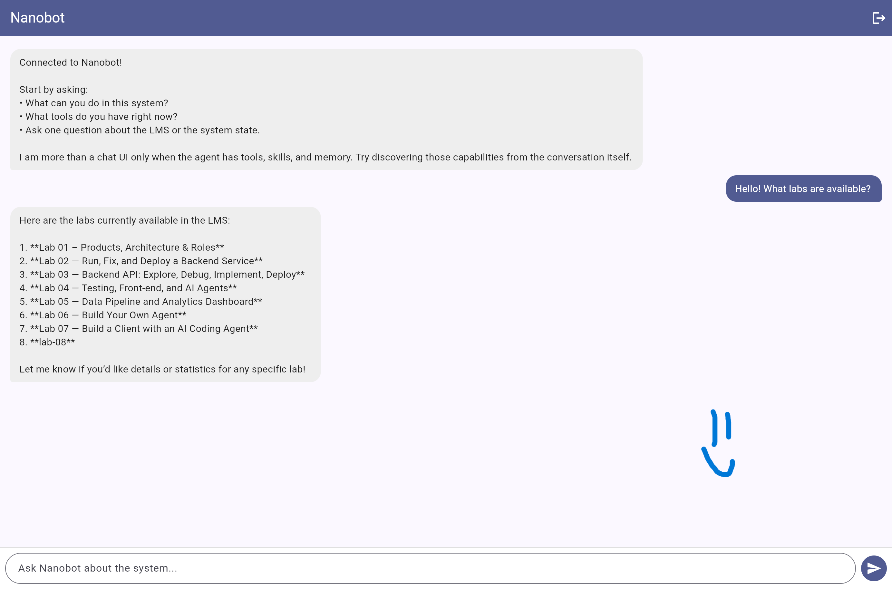

# Lab 8 — Report

Paste your checkpoint evidence below. Add screenshots as image files in the repo and reference them with ``.

## Task 1A — Bare agent

**Q: What is the agentic loop?**

```
The agentic loop is the recurring cycle that lets an autonomous software agent
(or AI system) perceive, think, act, and learn from its own actions. It can be
broken down into four steps:

 1 Perception / Observation – Gather information from the environment (e.g.,
   read files, call APIs, receive user input, read sensors).
 2 Reasoning / Planning – Process the observations, update internal state, and
   decide on the next action (via prompting, symbolic reasoning, planning
   algorithms, policies, etc.).
 3 Action / Execution – Carry out the chosen operation that changes the
   environment (write files, send commands, make HTTP requests, schedule jobs,
   invoke tools, etc.).
 4 Feedback / Evaluation – Observe the outcome of the action, check success or
   error signals, and assess progress toward the goal.

After the feedback step the loop starts again with a new perception step, using
the updated knowledge to refine future decisions.

Why it's important
 • Autonomy: Repeating this cycle lets an agent operate with little human
   supervision.
 • Adaptivity: Feedback lets the agent correct mistakes and adjust to changing
   conditions.
 • Goal-directed behavior: Planning ensures actions are purposeful rather than
   random.

Variants
 • Reactive loops: Skip explicit planning and act directly on observations
   (simple rule-based bots).
 • Hierarchical loops: Higher-level loops set sub-goals for lower-level loops
   (common in robotics).
 • Learning loops: Incorporate model updates (e.g., reinforcement learning)
   during the feedback stage.
```

## Task 1B — Agent with LMS tools

**Q: What labs are available?**

```
Available labs

 #  Title
 ──────────────────────────────────────────────────────────
 1  Lab 01 – Products, Architecture & Roles
 2  Lab 02 — Run, Fix, and Deploy a Backend Service
 3  Lab 03 — Backend API: Explore, Debug, Implement, Deploy
 4  Lab 04 — Testing, Front‑end, and AI Agents
 5  Lab 05 — Data Pipeline and Analytics Dashboard
 6  Lab 06 — Build Your Own Agent
 7  Lab 07 — Build a Client with an AI Coding Agent
 8  lab‑08

Let me know if you’d like details about any specific lab!
```

**Q: Is the LMS backend healthy?**

```
The LMS backend is healthy, and it currently holds **56 items**.
```

## Task 1C — Skill prompt

**Q: Show me the scores** (without specifying a lab)

```
I can pull the scores for a specific lab, but I need to know which one you'd
like to see. Here are the available labs:

 1 Lab 01 – Products, Architecture & Roles
 2 Lab 02 — Run, Fix, and Deploy a Backend Service
 3 Lab 03 — Backend API: Explore, Debug, Implement, Deploy
 4 Lab 04 — Testing, Front‑end, and AI Agents
 5 Lab 05 — Data Pipeline and Analytics Dashboard
 6 Lab 06 — Build Your Own Agent
 7 Lab 07 — Build a Client with an AI Coding Agent
 8 lab‑08

Which lab's scores would you like to view?
```

## Task 2A — Deployed agent

Nanobot startup log (MCP tools registered, gateway started):

```
🐈 Starting nanobot gateway version 0.1.4.post5 on port 18790...
✓ Channels enabled: webchat
✓ Heartbeat: every 1800s
WebChat relay listening on 127.0.0.1:8766
WebChat starting on 0.0.0.0:8765
server listening on 0.0.0.0:8765
MCP: registered tool 'mcp_lms_lms_health' from server 'lms'
MCP: registered tool 'mcp_lms_lms_labs' from server 'lms'
MCP: registered tool 'mcp_lms_lms_learners' from server 'lms'
MCP: registered tool 'mcp_lms_lms_pass_rates' from server 'lms'
MCP: registered tool 'mcp_lms_lms_timeline' from server 'lms'
MCP: registered tool 'mcp_lms_lms_groups' from server 'lms'
MCP: registered tool 'mcp_lms_lms_top_learners' from server 'lms'
MCP: registered tool 'mcp_lms_lms_completion_rate' from server 'lms'
MCP: registered tool 'mcp_lms_lms_sync_pipeline' from server 'lms'
MCP server 'lms': connected, 9 tools registered
MCP: registered tool 'mcp_webchat_ui_message' from server 'webchat'
MCP server 'webchat': connected, 1 tools registered
Agent loop started
```

Agent responding via WebSocket (test query "Hello! What labs are available?"):

```
Tool call: mcp_lms_lms_labs({})
Tool call: mcp_lms_lms_sync_pipeline({})
Tool call: mcp_lms_lms_labs({})
Response: Here are the labs currently available in the LMS:
1. Lab 01 – Products, Architecture & Roles
2. Lab 02 — Run, Fix, and Deploy a Backend Service
3. Lab 03 — Backend API: Explore, Debug, Implement, Deploy
4. Lab 04 — Testing, Front-end, and AI Agents
5. Lab 05 — Data Pipeline and Analytics Dashboard
6. Lab 06 — Build Your Own Agent
7. Lab 07 — Build a Client with an AI Coding Agent
8. lab-08 — The Agent is the Interface
```

## Task 2B — Web client

Flutter chat UI:



WebSocket conversation with the agent (tested via `websocat` through Caddy at `ws://localhost:42002/ws/chat?access_key=...`):

```
Client → {"content": "Hello! What labs are available?"}

Server → {"type": "text", "content": "Here are the labs currently available in the LMS:

1. **Lab 01 – Products, Architecture & Roles**
2. **Lab 02 — Run, Fix, and Deploy a Backend Service**
3. **Lab 03 — Backend API: Explore, Debug, Implement, Deploy**
4. **Lab 04 — Testing, Front‑end, and AI Agents**
5. **Lab 05 — Data Pipeline and Analytics Dashboard**
6. **Lab 06 — Build Your Own Agent**
7. **Lab 07 — Build a Client with an AI Coding Agent**
8. **lab‑08**

Let me know if you'd like details about any specific lab or want to see scores, pass rates, or other metrics for one of them!", "format": "markdown"}
```

The agent called `mcp_lms_lms_labs` and `mcp_lms_lms_sync_pipeline` to fetch real LMS data before responding.

- Flutter web app served at `/flutter` via Caddy (HTTP 200)
- WebSocket endpoint `/ws/chat` proxies to nanobot:8765 (WebSocket upgrade confirmed)
- nanobot WebChat channel active on port 8765, relay on 8766
- Agent responds to user messages through the Flutter chat interface with real LMS-backed data

## Task 3A — Structured logging

<!-- Paste happy-path and error-path log excerpts, VictoriaLogs query screenshot -->

## Task 3B — Traces

<!-- Screenshots: healthy trace span hierarchy, error trace -->

## Task 3C — Observability MCP tools

<!-- Paste agent responses to "any errors in the last hour?" under normal and failure conditions -->

## Task 4A — Multi-step investigation

<!-- Paste the agent's response to "What went wrong?" showing chained log + trace investigation -->

## Task 4B — Proactive health check

<!-- Screenshot or transcript of the proactive health report that appears in the Flutter chat -->

## Task 4C — Bug fix and recovery

<!-- 1. Root cause identified
     2. Code fix (diff or description)
     3. Post-fix response to "What went wrong?" showing the real underlying failure
     4. Healthy follow-up report or transcript after recovery -->
